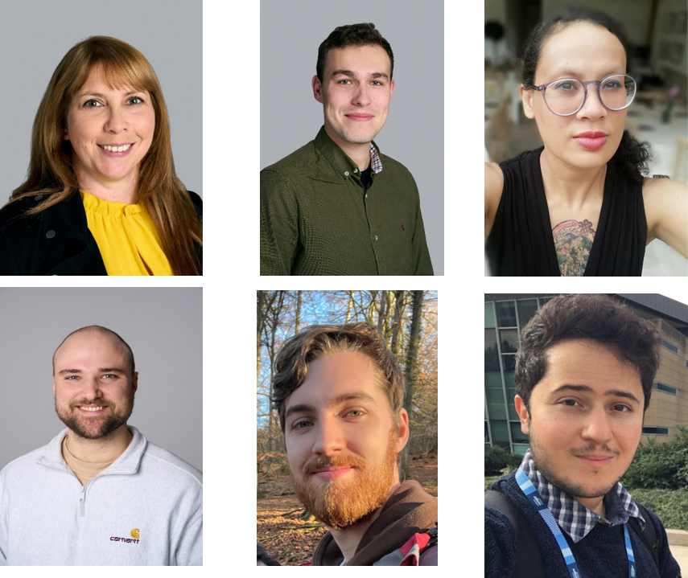

[Visual Assistive Version](modules/visual_assistive_main_page.md)

# Genome Academy

Welcome to the Genome Academy, a three day programme that will provide an in-depth look into genomics, with a  particular focus on how we translate DNA into Data.  

Genomics is a rapidly developing field of research and is increasingly weaving its way into everyday life, from playing a role in vaccine development, virus tracking, personalised cancer treatments, unveiling family histories, solving crime, and tackling the planet’s fragile ecosystems. There are a wide range of career opportunities in this field, some that didn’t even exist several years ago. 

Across three immersive days you will learn and experience the end to end process of how we translate DNA into data. The packed programme of activities will include talks on the latest cutting-edge science taking place at the Wellcome Sanger Institute, lab tours, hands-on experience with wet lab techniques such as DNA Extraction, PCR, DNA Sequencing as well as training with bioinformatics tools. You will also get the opportunity to meet a range of different staff working in this field.

# Course overview
The Genome Academy is a course designed and delivered by Wellcome Connecting Science, based at the Wellcome Genome Campus, Hinxton.

In this section find out who your instructors will be and what you will be covering over the three days. 

## Instructors
- **Fran Gale**, Head of Science Engagement - Engagement and Society Team

_Fran is the Head of Science Engagement for Wellcome Connecting Science. She manages the Science engagement team and develops training programmes on Genomics for Science teachers.  Fran has been working in Science engagement for over 20 years and before her role here on campus used to run the education department at Colchester Zoo!  She studied Biological Sciences at Exeter University and has an MSc in Science Comunication from UWE, Bristol._

- **Sam Shingles**, Science Engagement Officer - Engagement and Society Team

_Sam works with communities across East Anglia to provide opportunities to explore genomic science and its impact on research, health and society as part of the team at Wellcome Connecting Science on the Wellcome Genome Campus. Sam has previously worked within science centres and on science festivals to create activities and events that connect audiences with research. He has also worked within science policy, supporting local communities and researchers to interact with policymaking. Sam is passionate about providing accessible science to all, empowering communities to navigate the science topics important to them._
 
- **Cassandra Soo**, Laboratory Courses Manager - Learning and Training Team

_Cassandra has been the Laboratory Courses Manager of Wellcome Connecting Science since March 2022. It’s her job to assist with the development and to facilitate both campus-based and global advanced laboratory courses utilising her experience in facilities management and research background. Her PhD focused on the genetics of human cognitive function, and she has a deep interest in the genomics of neurological and psychiatric disorders. She’s been involved with community outreach projects in the past and believes that working for Connecting Science has a direct impact on the lives of potential and current researchers and professionals in the field of genomics._
 
- **Aaron Dean**, Laboratory Assistant - Learning and Training Team

_Aaron started working in a lab straight after graduating from the University of Portsmouth with a BSc in Biochemistry. I spent 4 years working at a microbiology lab in a hospital as a laboratory assistant, before starting at Wellcome Connecting Science in 2020.   He enjoys working on a variety of courses based here at the Wellcome Genome Campus and overseas, setting up experiments and assisting a variety of expert training teams from around the world._
  
- **Jorge Batista da Rocha**, Education Developer - Learning and Training Team

_Jorge joined Wellcome Connecting Science in October 2021 as an Education Developer working on COG-Train courses. Jorge’ role is to create and coordinate virtual courses and remote classrooms on all aspects of SARS-CoV-2 sequencing and analysis.  Jorge holds a PhD Human Genetics and Bioinformatics from the Sydney Brenner Institute for Molecular Bioscience. His research focused on pharmacogenomics in African populations and the interpretation of genetic variants which could be used for precision medicine strategies. He enjoys community outreach and engagement, and loves sharing how genomic knowledge can be used to enrich the world._

- **Chris Adamson**, Laboratory Operations Officer - Learning and Training Team

_Chris is a Laboratory Operations Officer, helping to organise and facilitate lab practical sessions for courses. Previously he graduated with a BSc in Biochemistry worked in hospital microbiology and COVID diagnostics._

<i>Top Row: Fran Gale, Sam Shingles, Casandra Soo </i>
 
<i>Bottom Row: Aaron Dean, Chris Adamson, Jorge Batista da Rocha</i>

## Speakers
- Michael Ansah, Postdoctoral Fellow - Tree of Life Team
- Yvette Hooks, Senior Technical Specialist - Cancer, Ageing and Somatic Mutations Team
- Maria Torra I Benach, PhD Student - Cancer, Ageing and Somatic Mutations Team
- Mimy Pham, PhD Student - Cancer, Ageing and Somatic Mutations team
- Lia Chappell, Postdoctoral Fellow - Cancer, Ageing and Somatic Mutations Team
- Sam Washer, Postdoctoral Fellow - Gene Editing and Cellular Research and Development Team
- Anna Swan, Scientific Training Officer - EMBL-EBI Training Team
 
## Detailed timetable
You can view the full timetable here:
[Student timetable](modules/Genome Academy 9-11th April Student programme.pdf) 

# Course materials
In this section you will find all the materials used during the course so you can refer to them during the practical sessions and after the course has ended.

**Day 1**   
[Introduction to campus presentation](modules/Welcome to Genome Academy april 24.pdf)

[DNA to Data Worksheet](modules/DNA_to_ data_worksheet.pdf)

[Lab Practical Skills presentation](modules/Practical skills slides 2023.pdf)
  
[DNA extraction - strawberries](modules/dna_extraction_strawberries.md)

[Protocol for performing quick PCR session 1 and 2](modules/quick_pcr_protocol.md)

**Day 2**  
[Open Lab Video](https://www.youtube.com/watch?v=M3wY7kvg8i4)

[Introduction to MinION sequencing presentation](modules/An Introduction to Minion Sequencing- Genome Academy.pdf)

[Single Cell Sequencing - Lia Chappell](modules/2023.08.23.Lia_Single_Cell_talk.pdf)

  
**Day 3**  
[Ethics and Genomics presentation](modules/Ethics and Genomics - Genome Academy .pdf)

[ABC vs NHS videos](https://societyandethicsresearch.wellcomeconnectingscience.org/project/abc-versus-st-georges-nhs-trust/)

[Bioinformatics - Part 1 - Linux, fasta and blasting](modules/bioinformatics_blasting.md)   

[Bioinformatics - Part 2 - Evolution of Taste Receptor Genes](modules/bioinformatics_msa.md) 

[Function Finders BLAST - Bioinformatics Activity](https://www.yourgenome.org/activities/function-finders-blast/)

# Further Reading and Useful resources      
Below are links to some further reading and resources

## DNA 101
**What is DNA?**

[Yourgenome - What is DNA](https://www.yourgenome.org/theme/what-is-dna/)

**What does DNA do?**

[Yourgenome - What does DNA do](https://www.yourgenome.org/theme/how-is-dna-turned-into-protein-the-central-dogma-of-molecular-biology/)

**What is a gene?**

[Yourgenome - What is a gene](https://www.yourgenome.org/theme/what-is-a-gene/)

[Sanger Institute Blog - What is a gene](https://sangerinstitute.blog/2023/08/10/what-is-a-gene/)

**What is gene expression?**

[Yourgenome - What is gene expression](https://www.yourgenome.org/theme/what-is-gene-expression/)

**What is RNA?**

[Yourgenome - What is RNA](https://www.yourgenome.org/theme/what-is-rna/)

**What is RNA splicing?**

[Yourgenome - What is RNA splicing](https://www.yourgenome.org/theme/what-is-rna-splicing/)

**What is PCR?**

[Yourgenome - What is PCR](https://www.yourgenome.org/facts/what-is-pcr-polymerase-chain-reaction/)

**What is Gel electrophoresis?**

[Yourgenome - What is Gel eletropherisis](https://www.yourgenome.org/theme/what-is-gel-electrophoresis/)

## Sequencing resources
**Sequencing technologies, past, present and future**

[Yourgenome - Sequencing technologies, past, present and future](https://www.yourgenome.org/theme/sequencing-technologies-past-present-and-future/)

**Sequencing at speed (Illumina sequencing)**

[Animation - Sequencing at speed](https://www.yourgenome.org/theme/sequencing-at-speed/)

**What is Nanopore sequencing?**

[Yourgenome - What is Nanopore sequencing](https://www.yourgenome.org/theme/what-is-oxford-nanopore-technology-ont-sequencing/)

[Oxford Nanopore - Nanopore sequencing](https://nanoporetech.com/applications/dna-nanopore-sequencing)

**Life in the lab (DNA Pipelines)**

[Video - Life in the lab](https://www.yourgenome.org/theme/life-in-the-lab-working-in-dna-sequencing-pipeline/)

**What is RNA sequencing?**

[Yourgenome - What is RNA sequencing](https://www.yourgenome.org/theme/what-is-rna-sequencing/)

## Genome editing
**What is genome editing?**

[Yourgenome - What is genome editing](https://www.yourgenome.org/theme/what-is-genome-editing/)

**What is CRISPR-Cas9?**

[Yourgenome - What is CRISPR-Cas9](https://www.yourgenome.org/theme/what-is-crispr-cas9/)

**How do we use CRISPR-Cas9 to study diseases?**

[Yourgenome - How do we use CRISPR-Cas9 to study diseases](https://www.yourgenome.org/theme/how-do-we-use-crispr-gene-editing-to-study-diseases/)

**My career in cellular operations**

[Video - My career in cellular operations](https://www.yourgenome.org/theme/my-career-in-genomics-cellular-operations/)

## Bioinformatics
**What is bioinformatics**

[Yourgenome - What is bioinformatics](https://www.yourgenome.org/theme/what-is-bioinformatics-and-how-do-we-use-it/)

**My career in bioinformatics**

[Video - My career in bioinformatics](https://www.yourgenome.org/theme/my-career-in-genomics-bioinformatics/)

## Citizens' Jury on Human Embryo Editing

[Citizens' Jury Webpage](https://societyandethicsresearch.wellcomeconnectingscience.org/project/uk-citizens-jury-on-genome-editing/)

# Questionnaires

[Pre-Course Questionnaire](https://forms.gle/2z3iCKuLcNXAE15m7)

[Post-Course Questionnaire](https://forms.gle/WHpKtjuBSnK4Yvoz6)

Any reuse of the course materials, data or code is encouraged with due acknowledgement.

******
## License
 This work is licensed under a <a rel="license" href="https://creativecommons.org/licenses/by-nc-sa/4.0/">Attribution-NonCommercial-ShareAlike 4.0 International (CC BY-NC-SA 4.0)</a>.

