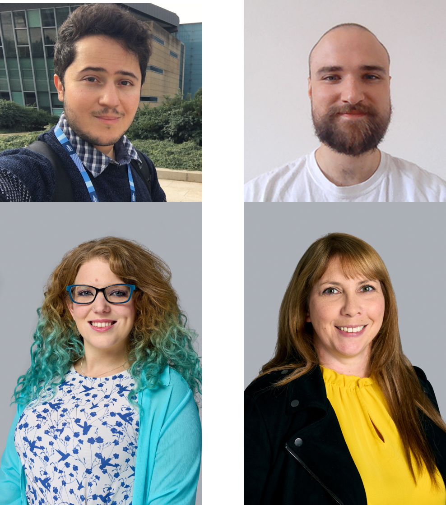

# Genome Academy

Welcome to the Genome Academy, a three day programme that will provide an in-depth look into genomics, with a  particular focus on how we translate DNA into Data.  

Genomics is a rapidly developing field of research and is increasingly weaving its way into everyday life, from playing a role in vaccine development, virus tracking, personalised cancer treatments, unveiling family histories, solving crime, and tackling the planet’s fragile ecosystems. There are a wide range of career opportunities in this field, some that didn’t even exist several years ago. 

Across three immersive days you will learn and experience the end to end process of how we translate DNA into data. The packed programme of activities will include talks on the latest cutting-edge science taking place at the Wellcome Sanger Institute, lab tours, hands-on experience with wet lab techniques such as DNA Extraction, PCR, DNA Sequencing as well as training with bioinformatics tools. You will also get the opportunity to meet a range of different staff working in this field.

# Course overview
The Genome Academy is a course designed and delivered by Wellcome Connecting Science, based at the Wellcome Genome Campus, Hinxton.

In this section find out who your instructors will be and what you will be covering over the three days. 

## Instructors
- Fran Gale, Head of Science Engagement - Engagement and Society Team
- Cindy Smidt, Science Engagement Officer - Engagement and Society Team
- Cassandra Soo, Laboratory Courses Manager - Learning and Training Team
- Aaron Dean, Laboratory Assistant - Learning and Training Team
- Jorge Batista da Rocha, Education Developer - Learning and Training Team

<i>Top Row: Jorge Batista da Rocha, Aaron Dean</i>

 <i>Bottom Row: Cindy Smidt, Fran Gale</i>

## Speakers
- Petra Korlević, Staff Scientist - Darwin Tree of Life Team
- Yvette Hooks, Senior Technical Specialist - Cancer, Ageing and Somatic Mutations Team
- Pantelis Nicola,  
- Lia Chappell, Postdoctoral Fellow - Cancer, Ageing and Somatic Mutations Team
- Andrew Bassett, Head of Cellular Research - Cellular and Gene Editing Research Team
- Kim Gurwitz, Scientific Training Lead - EMBL-EBI Training Team
- Sam Shingles, Science Engagement Officer - Engagement and Society Team

 
## Detailed timetable
You can view the full timetable here: [Genome Academy 22-24 August Student programme .docx.pdf](https://github.com/WCSCourses/genomeacademy/files/12335532/Genome.Academy.22-24.August.Student.programme.docx.pdf)

# Course materials
In this section you will find all the materials used during the course so you can refer to them during the practical sessions and after the course has ended.

**Day 1**   
[DNA extraction - Saliva.docx.pdf](https://github.com/WCSCourses/genomeacademy/files/12335655/DNA.extraction.-.Saliva.docx.pdf)     

[DNA extraction - strawberries.pdf](https://github.com/WCSCourses/genomeacademy/files/12335656/DNA.extraction.-.strawberries.pdf)

[Protocol for performing quick PCR  session 1 and 2.pdf](https://github.com/WCSCourses/genomeacademy/files/12335662/Protocol.for.performing.quick.PCR.session.1.and.2.pdf)

**Day 2**  
[Online Manual - Introduction to NGS](Modules/)
  
**Day 3**  
[Online Manual - Mod4l QC](Modules/)

# Useful resources      
  Below are links to some further reading and resources

  ***DNA Sequencing***
 
# Questionnaires

Any reuse of the course materials, data or code is encouraged with due acknowledgement.

******
## License
 This work is licensed under a <a rel="license" href="https://creativecommons.org/licenses/by-nc-sa/4.0/">Attribution-NonCommercial-ShareAlike 4.0 International (CC BY-NC-SA 4.0)</a>.

